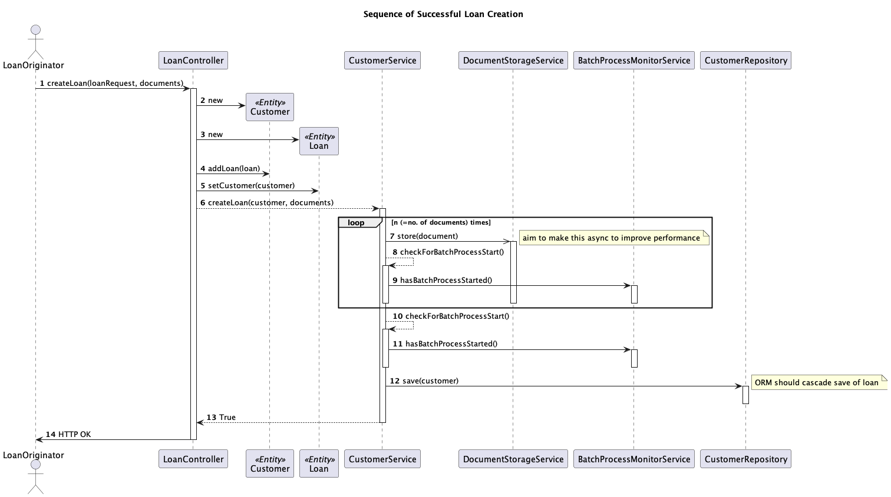

_TO BE VERIFIED BEFORE PUBLISHING_

## Design Criteria

- Loan creation must not infringe on overnight the batch process that requires the loan data to be stable
  - The general requirement to not process as the batch process is being run can be handled in the broader
    architecture,re-routing access to stub-endpoint that is hardcoded to return a failure response with
    specific error message notifying that the service is down for processing.
  - However, the crux of the matter is how to handle loans that are in-flight as the clock ticks over into
    the batch process's operational hours.
    - Depending on their number and size , and other technical factors, the upload of the related
      documents could take a good deal of time.
- Creation of loan with partial data is not an option.
- The client should receive accurate information in a timely fashion. They should receive a response in a
  time frame appropriate to an API with a response that clearly communicates whether the loan was
  created successfully and if they should re-submit if not

## Overall Architecture

A simple solution to the loan creation application knowing when the batch process was running would be simply
to set operational times within it, but it would be preferable for the batch process to communicate it's
starting to the loan creation application using a message on a queue that the loan creating application polls.

In this way the batch process itself would be a single source of truth as to when it was starting meaning
that:

- If the hours of operation of the batch process changes in the future there would be no need to
  update the loan creation application configuration thereby avoiding the consequences should that change
  being neglected.
- The batch process could signal more precisely as to when it needed data creation to stop, perhaps
  avoiding the abortion of some loan creation if there was a hard time limit set.
  - gateway should still stop accepting new requests at the stated time for consistency to the clients.

## Client API Design

- Basic idea of the design here is that as the probable slowest piece of the process the storage of the
  documents should be completed before the customer and loan are added to the database.
  - Idea is to make the _store_ call (step 5) asynchronous so that files can be stored simultaneously.
- After each file is uploaded a check will be made to determine if the batch process has started (6) and the
  upload will abort at that point.
  - BatchProcessMonitorService implementation will poll the message queue for a new message signalling the
    start of the batch process
    - If step 5 does become asynchronous the idea would be to abort any threaded uploads started.
- A final check (8) is made that the batch process has not yet started just before saving the customer and
  loan data into the database.
  - The database update might be put into a transaction created before the file upload but only committed
    after the check at step 8.

## Assumptions

- The possibility of the customer or loan already existing is largely being ignored
  in this solution. The
  data and files of a previous upload may just get overwritten by the next and this will happen silently.
  
- API gateway can stop accepting new requests while still sending responses back
  for those still in flight.

## Proposed Improvements

- Any uploaded files would still be left orphaned in the document storage if the loan creation did not
  complete fully. These ideally should be deleted now while the system still has knowledge of them.
- Rather than polling for the batch mode process throughout the day an earlier
  message could be sent to warn that the batch process will be starting within a given time frame at which
  point the polling would begin. This would hopefully provide a performance improvement during normal
  operation hours.
